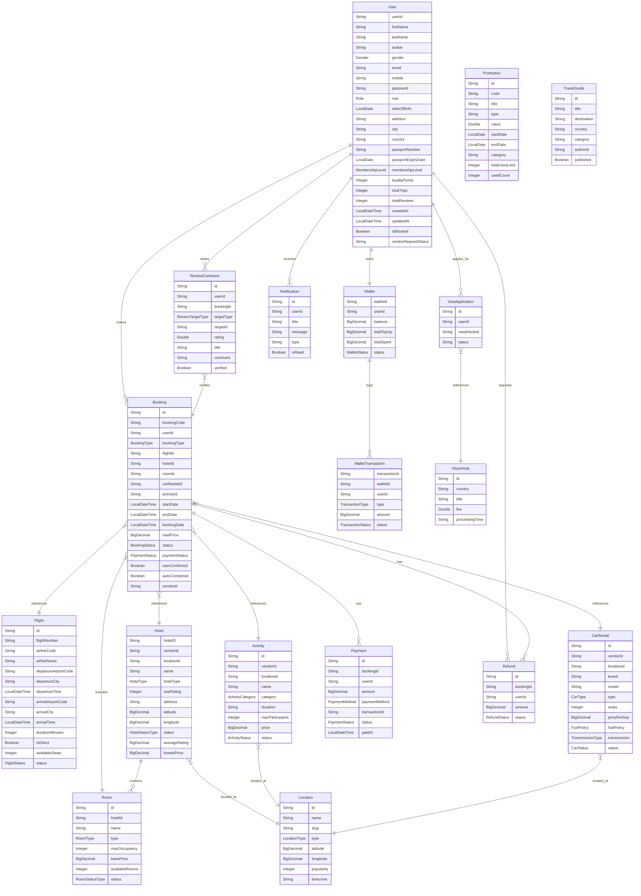

# Database Design

## 1. Entity Relationship Diagram (ERD)

This diagram represents the conceptual data model based on the actual Java Entity classes.

## 2. Relational Schema

This diagram details the schema attributes based on the Java entities.

```mermaid
erDiagram
    User {
        String userId PK
        String firstName
        String lastName
        String avatar
        Gender gender
        String email "Unique"
        String mobile
        String password
        Role role
        LocalDate dateOfBirth
        String address
        String city
        String country
        String passportNumber
        LocalDate passportExpiryDate
        MembershipLevel membershipLevel
        Integer loyaltyPoints
        Integer totalTrips
        Integer totalReviews
        LocalDateTime createdAt
        LocalDateTime updatedAt
        Boolean isBlocked
        String vendorRequestStatus
        String notificationSettings "Object"
    }

    Booking {
        String id PK
        String bookingCode "Unique"
        String userId FK
        BookingType bookingType
        String flightId FK "Nullable"
        String hotelId FK "Nullable"
        String roomId FK "Nullable"
        String carRentalId FK "Nullable"
        String activityId FK "Nullable"
        LocalDateTime startDate
        LocalDateTime endDate
        LocalDateTime bookingDate
        BigDecimal basePrice
        BigDecimal taxes
        BigDecimal fees
        BigDecimal discount
        BigDecimal totalPrice
        String currency
        String voucherCode
        PaymentStatus paymentStatus
        PaymentMethod paymentMethod
        BookingStatus status
        String vendorId FK
        Boolean userConfirmed
        Boolean autoCompleted
        GuestInfo guestInfo "Object"
        GuestCount numberOfGuests "Object"
    }

    Booking_Metadata {
        String bookingId PK,FK
        String key
        String jsonValue
    }

    Flight {
        String id PK
        String flightNumber
        String airlineCode
        String airlineName
        String departureAirportCode
        String departureCity
        LocalDateTime departureTime
        String arrivalAirportCode
        String arrivalCity
        LocalDateTime arrivalTime
        Integer durationMinutes
        Boolean isDirect
        Integer stops
        String aircraftType
        Integer availableSeats
        FlightStatus status
        List_String amenities "JSON Array"
    }

    Flight_StopInfo {
        String flightId FK
        String airportCode
        String city
        Integer durationMinutes
    }

    Flight_CabinClass {
        String flightId FK
        String className
        BigDecimal fromPrice
        Boolean available
    }

    Hotel {
        String hotelID PK
        String vendorId FK
        String locationId FK
        String name
        String slug
        HotelType hotelType
        Integer starRating
        String address
        BigDecimal latitude
        BigDecimal longitude
        HotelStatusType status
        BigDecimal averageRating
        BigDecimal lowestPrice
        List_String amenities "JSON Array"
    }

    Hotel_Image {
        String hotelId FK
        String url
        String caption
    }

    Room {
        String id PK
        String hotelId FK
        String name
        RoomType type
        Integer maxOccupancy
        BigDecimal size
        BigDecimal basePrice
        Integer availableRooms
        RoomStatusType status
        CancellationPolicyType cancellationPolicy
        Boolean refundable
        Boolean breakfastIncluded
    }

    Activity {
        String id PK
        String vendorId FK
        String locationId FK
        String name
        ActivityCategory category
        String type
        String duration
        Integer maxParticipants
        Integer minParticipants
        ActivityDifficulty difficulty
        BigDecimal price
        ActivityStatus status
        List_String included "Array"
    }

    CarRental {
        String id PK
        String vendorId FK
        String locationId FK
        String brand
        String model
        CarType type
        Integer seats
        FuelType fuelType
        TransmissionType transmission
        BigDecimal pricePerDay
        Boolean withDriver
        CarStatus status
    }

    Location {
        String id PK
        String name
        String slug
        LocationType type
        String parentLocationId FK
        BigDecimal latitude
        BigDecimal longitude
        String timezone
        Integer popularity
        Map_String_Object metadata "JSON"
    }

    Payment {
        String id PK
        String bookingId FK
        String userId FK
        BigDecimal amount
        String currency
        PaymentMethod paymentMethod
        String transactionId "Unique"
        String gatewayTransactionId
        PaymentStatus status
        LocalDateTime paidAt
        LocalDateTime failedAt
        BigDecimal refundAmount
    }

    Promotion {
        String id PK
        String code
        String title
        String type
        Double value
        Double maxDiscount
        Double minSpend
        LocalDate startDate
        LocalDate endDate
        String category
        Integer totalUsesLimit
        Integer usedCount
    }

    ReviewComment {
        String id PK
        String userId FK
        String bookingId FK
        ReviewTargetType targetType
        String targetId FK
        Double rating
        String title
        String comment
        Boolean verified
        ReviewStatus status
        TravelType travelType
    }

    Wallet {
        String walletId PK
        String userId FK
        BigDecimal balance
        BigDecimal totalTopUp
        BigDecimal totalSpent
        WalletStatus status
    }

    WalletTransaction {
        String transactionId PK
        String walletId FK
        String userId FK
        TransactionType type
        BigDecimal amount
        TransactionStatus status
        String bookingId FK
    }

    Refund {
        String id PK
        String bookingId FK
        String userId FK
        BigDecimal amount
        RefundStatus status
        String reason
        String adminResponse
    }

    TravelGuide {
        String id PK
        String title
        String destination
        String country
        String category
        String authorId
        Boolean published
        Boolean featured
    }

    VisaArticle {
        String id PK
        String country
        String title
        Double fee
        String validity
        List_String requirements "Array"
    }

    VisaApplication {
        String id PK
        String userId FK
        String visaArticleId FK
        String status
        String passportNumber
        String nationality
    }
    
    Notification {
        String id PK
        String userId FK
        String title
        String message
        String type
        Boolean isRead
        LocalDateTime createdAt
    }

    %% Relationships
    User ||--o{ Booking : makes
    User ||--|| Wallet : owns
    User ||--o{ Payment : makes
    User ||--o{ ReviewComment : posts
    User ||--o{ Notification : receives
    User ||--o{ VisaApplication : submits
    User ||--o{ Refund : requests

    Booking ||--o{ Payment : has
    Booking ||--o{ Refund : related_to
    Booking ||--o{ ReviewComment : reviewed_in
    Booking ||--o{ Booking_Metadata : contains

    Flight ||--o{ Flight_StopInfo : has
    Flight ||--o{ Flight_CabinClass : offers

    Hotel ||--o{ Room : owns
    Hotel ||--o{ Hotel_Image : has

    Wallet ||--o{ WalletTransaction : contains
    
    Location ||--o{ Hotel : contains
    Location ||--o{ Activity : contains
    Location ||--o{ CarRental : contains
```

