# Wanderlust Travel Platform - System Diagrams

## Table of Contents
1. [Class Diagram - Core Entities](#class-diagram---core-entities)
2. [Class Diagram - User Management](#class-diagram---user-management)
3. [Class Diagram - Booking System](#class-diagram---booking-system)
4. [Class Diagram - AI Chatbot Module](#class-diagram---ai-chatbot-module)
5. [Sequence Diagram - User Authentication](#sequence-diagram---user-authentication)
6. [Sequence Diagram - Flight Booking](#sequence-diagram---flight-booking)
7. [Sequence Diagram - Hotel Booking](#sequence-diagram---hotel-booking)
8. [Sequence Diagram - AI Chatbot Itinerary Planning](#sequence-diagram---ai-chatbot-itinerary-planning)
9. [Sequence Diagram - POI Data Crawler](#sequence-diagram---poi-data-crawler)
10. [Activity Diagram - Booking Process](#activity-diagram---booking-process)
11. [Activity Diagram - Payment Process](#activity-diagram---payment-process)
12. [Activity Diagram - Itinerary Generation (plusTour Algorithm)](#activity-diagram---itinerary-generation-plustour-algorithm)
13. [Component Diagram - System Architecture](#component-diagram---system-architecture)

---

## Class Diagram - Core Entities

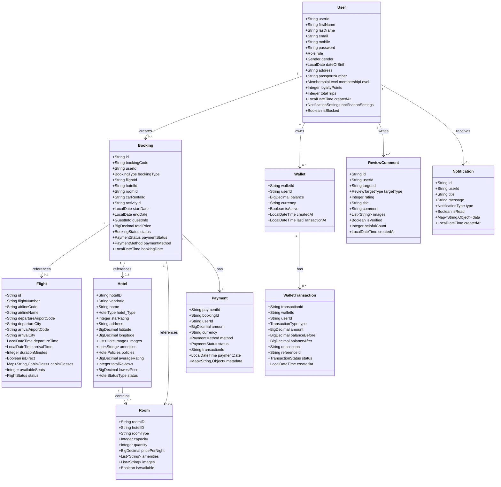

---

## Class Diagram - User Management

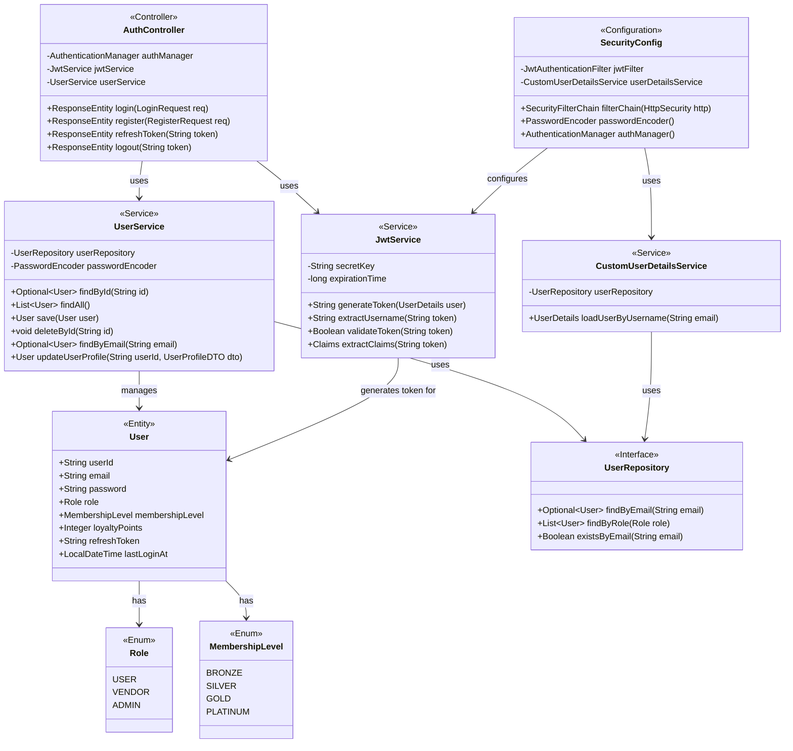

---

## Class Diagram - Booking System

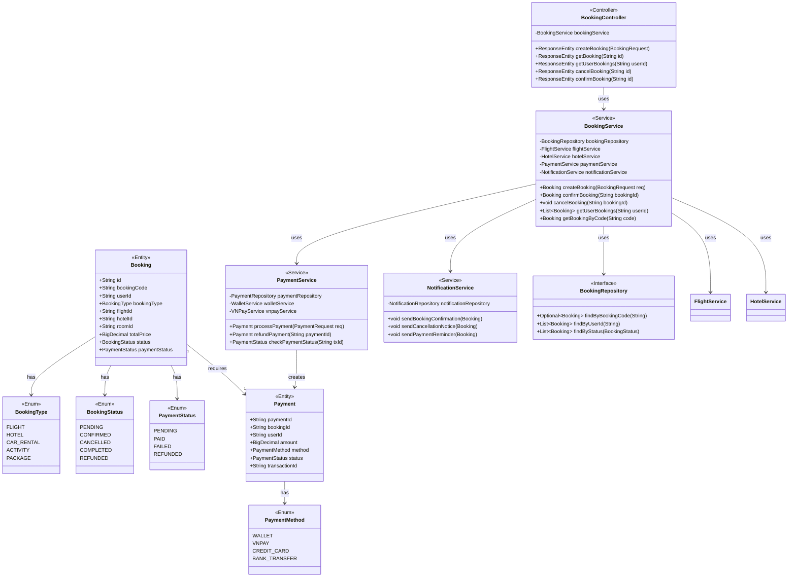

---

## Class Diagram - AI Chatbot Module

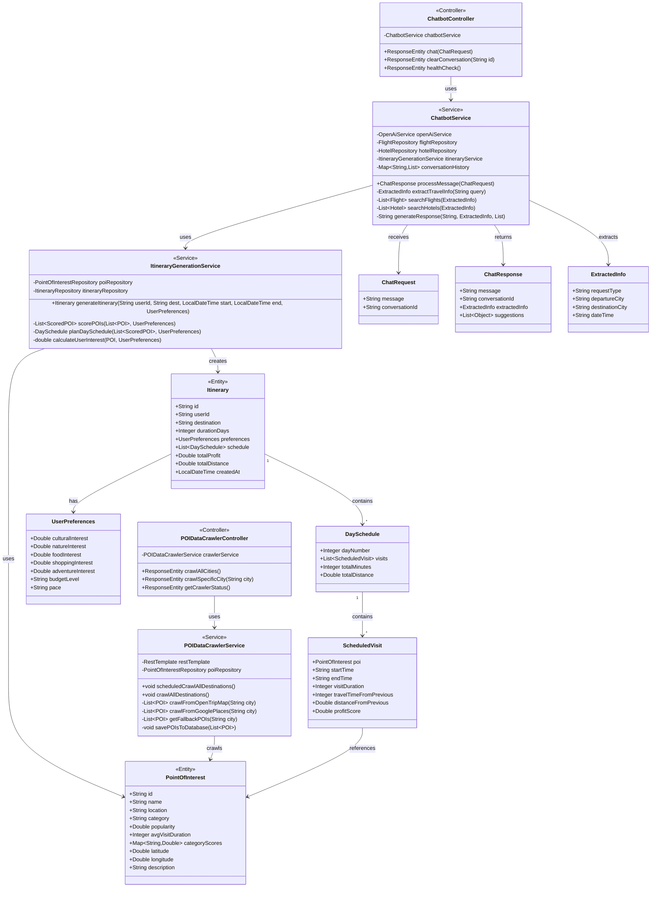

---

## Sequence Diagram - User Authentication

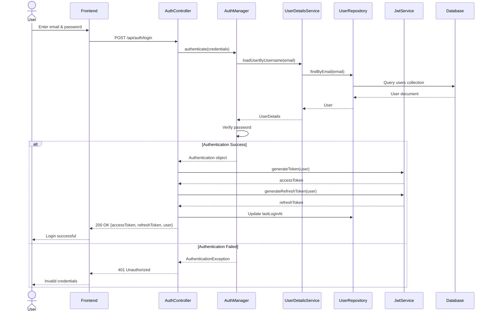

---

## Sequence Diagram - Flight Booking

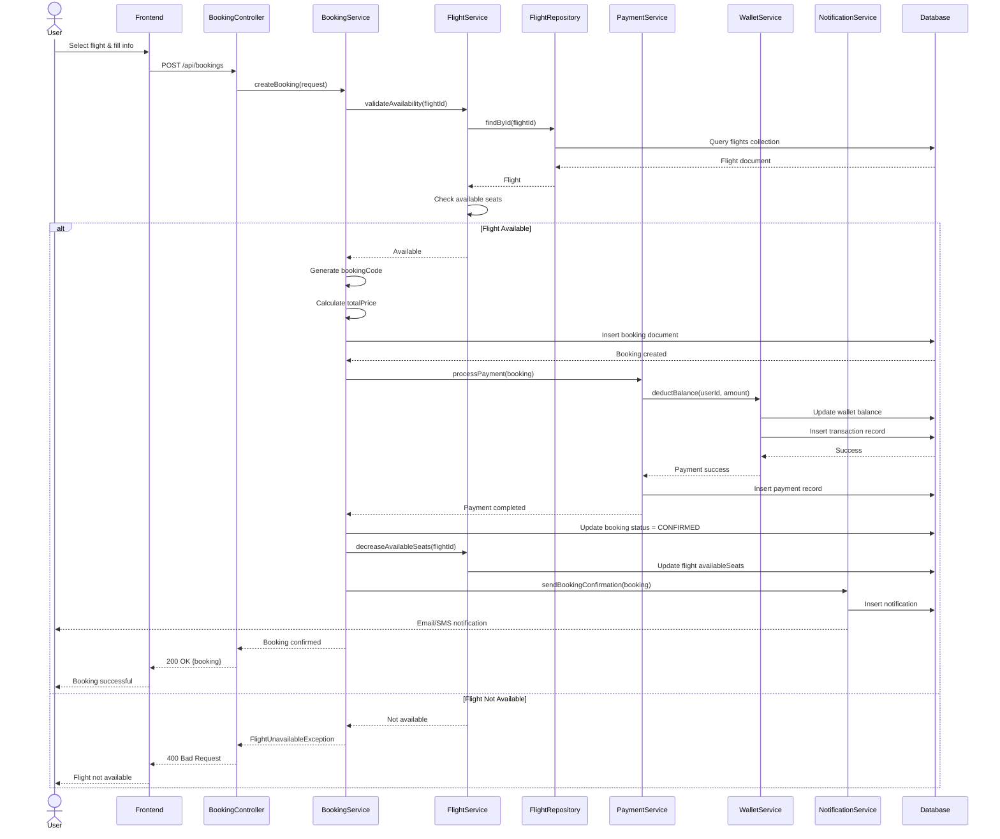

---

## Sequence Diagram - Hotel Booking

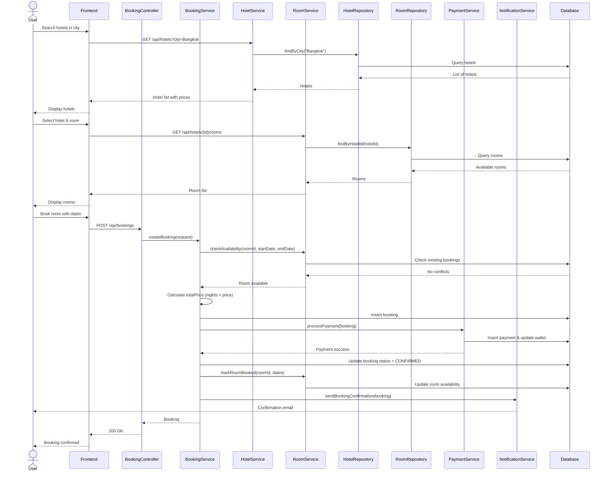

---

## Sequence Diagram - AI Chatbot Itinerary Planning

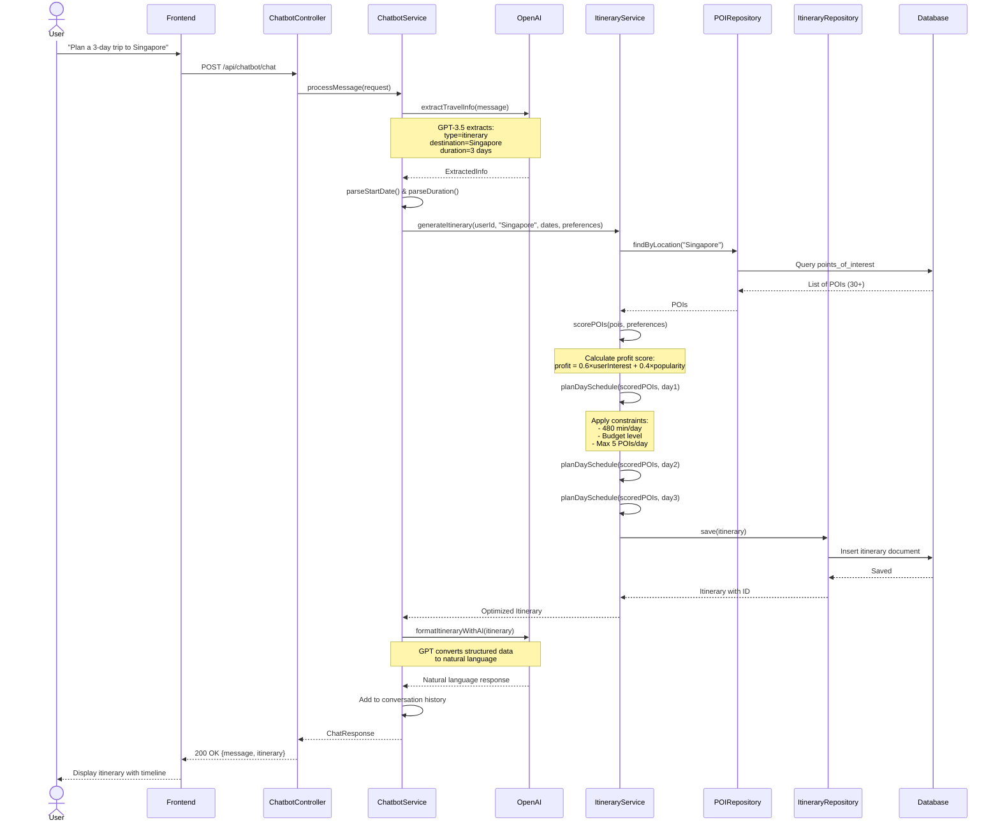

---

## Sequence Diagram - POI Data Crawler

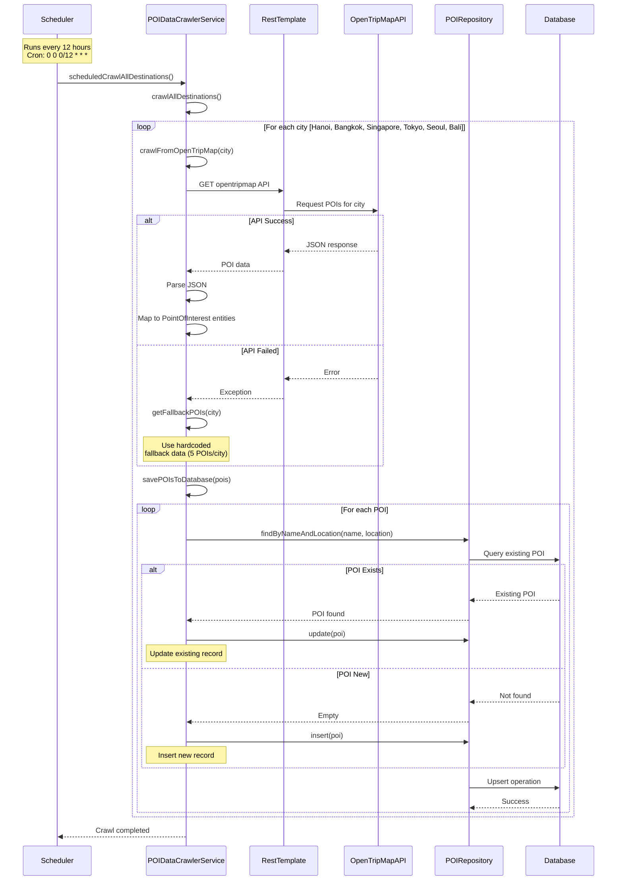

---

## Activity Diagram - Booking Process

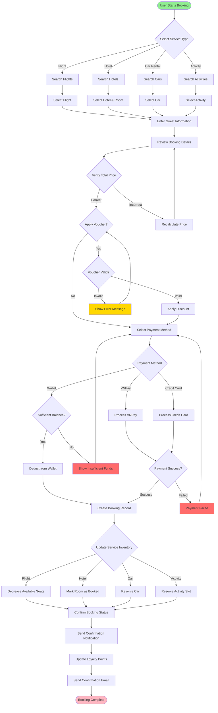

---

## Activity Diagram - Payment Process

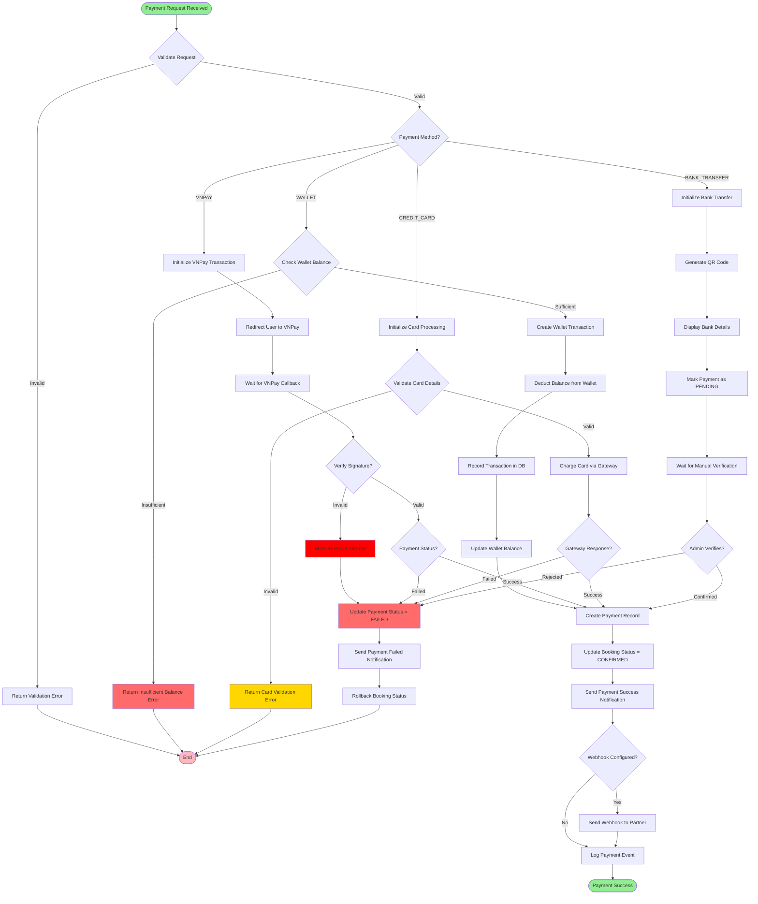

---

## Activity Diagram - Itinerary Generation (plusTour Algorithm)

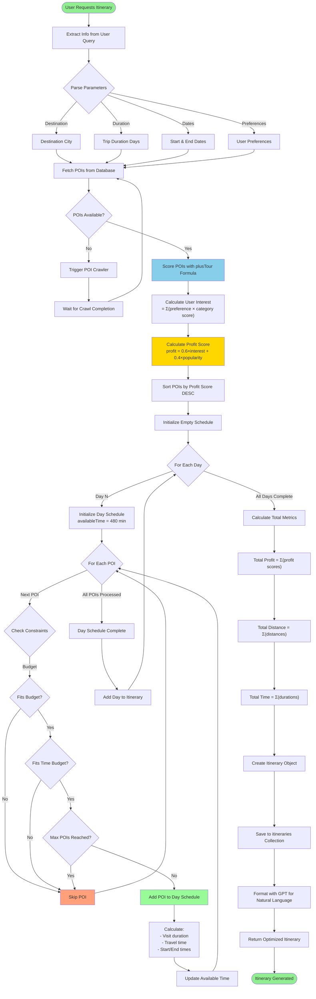

---

## Component Diagram - System Architecture

```mermaid
graph TB
    subgraph "Frontend Layer (React + TypeScript + Vite)"
        UI[User Interface Components]
        API_Client[API Client - Axios]
        State[State Management]
        Router[React Router]
        I18N[i18n - Multilingual]
    end
    
    subgraph "API Gateway Layer"
        Gateway[Spring Boot API Gateway<br/>Port 8080]
        Security[Spring Security + JWT]
        CORS[CORS Configuration]
    end
    
    subgraph "Controller Layer"
        AuthCtrl[AuthController]
        BookingCtrl[BookingController]
        FlightCtrl[FlightController]
        HotelCtrl[HotelController]
        ChatbotCtrl[ChatbotController]
        PaymentCtrl[PaymentController]
        UserCtrl[UserController]
        AdminCtrl[Admin Controllers]
    end
    
    subgraph "Service Layer (Business Logic)"
        AuthSvc[Authentication Service]
        BookingSvc[Booking Service]
        FlightSvc[Flight Service]
        HotelSvc[Hotel Service]
        ChatbotSvc[Chatbot Service]
        ItinerarySvc[Itinerary Generation Service]
        CrawlerSvc[POI Data Crawler Service]
        PaymentSvc[Payment Service]
        WalletSvc[Wallet Service]
        NotificationSvc[Notification Service]
        UserSvc[User Service]
    end
    
    subgraph "Repository Layer"
        UserRepo[User Repository]
        BookingRepo[Booking Repository]
        FlightRepo[Flight Repository]
        HotelRepo[Hotel Repository]
        POIRepo[POI Repository]
        ItineraryRepo[Itinerary Repository]
        PaymentRepo[Payment Repository]
        WalletRepo[Wallet Repository]
    end
    
    subgraph "Database Layer"
        MongoDB[(MongoDB<br/>localhost:27017)]
    end
    
    subgraph "External Services"
        OpenAI[OpenAI API<br/>GPT-3.5-turbo]
        OpenTripMap[OpenTripMap API<br/>POI Data]
        GooglePlaces[Google Places API<br/>Optional]
        VNPay[VNPay Gateway<br/>Payment]
        EmailSvc[Email Service<br/>SMTP]
    end
    
    subgraph "Scheduled Tasks"
        Scheduler[Spring @Scheduled]
        CrawlerJob["POI Crawler Job<br/>(Every 12 hours)"]
    end
    
    %% Frontend Connections
    UI --> API_Client
    API_Client --> Gateway
    State --> UI
    Router --> UI
    I18N --> UI
    
    %% Gateway Connections
    Gateway --> Security
    Gateway --> CORS
    Security --> AuthCtrl
    Security --> BookingCtrl
    Security --> FlightCtrl
    Security --> HotelCtrl
    Security --> ChatbotCtrl
    Security --> PaymentCtrl
    Security --> UserCtrl
    Security --> AdminCtrl
    
    %% Controller to Service Connections
    AuthCtrl --> AuthSvc
    BookingCtrl --> BookingSvc
    FlightCtrl --> FlightSvc
    HotelCtrl --> HotelSvc
    ChatbotCtrl --> ChatbotSvc
    PaymentCtrl --> PaymentSvc
    UserCtrl --> UserSvc
    AdminCtrl --> BookingSvc
    AdminCtrl --> UserSvc
    
    %% Service Layer Connections
    AuthSvc --> UserRepo
    BookingSvc --> BookingRepo
    BookingSvc --> FlightSvc
    BookingSvc --> HotelSvc
    BookingSvc --> PaymentSvc
    BookingSvc --> NotificationSvc
    FlightSvc --> FlightRepo
    HotelSvc --> HotelRepo
    ChatbotSvc --> FlightRepo
    ChatbotSvc --> HotelRepo
    ChatbotSvc --> ItinerarySvc
    ChatbotSvc --> OpenAI
    ItinerarySvc --> POIRepo
    ItinerarySvc --> ItineraryRepo
    CrawlerSvc --> POIRepo
    CrawlerSvc --> OpenTripMap
    CrawlerSvc --> GooglePlaces
    PaymentSvc --> PaymentRepo
    PaymentSvc --> WalletSvc
    PaymentSvc --> VNPay
    WalletSvc --> WalletRepo
    NotificationSvc --> EmailSvc
    UserSvc --> UserRepo
    
    %% Repository to Database
    UserRepo --> MongoDB
    BookingRepo --> MongoDB
    FlightRepo --> MongoDB
    HotelRepo --> MongoDB
    POIRepo --> MongoDB
    ItineraryRepo --> MongoDB
    PaymentRepo --> MongoDB
    WalletRepo --> MongoDB
    
    %% Scheduled Tasks
    Scheduler --> CrawlerJob
    CrawlerJob --> CrawlerSvc
    
    %% Styling
    classDef frontend fill:#61DAFB,stroke:#333,stroke-width:2px,color:#000
    classDef backend fill:#6DB33F,stroke:#333,stroke-width:2px,color:#000
    classDef database fill:#4DB33D,stroke:#333,stroke-width:2px,color:#fff
    classDef external fill:#FF6B6B,stroke:#333,stroke-width:2px,color:#fff
    classDef scheduler fill:#FFD93D,stroke:#333,stroke-width:2px,color:#000
    
    class UI,API_Client,State,Router,I18N frontend
    class Gateway,Security,CORS,AuthCtrl,BookingCtrl,FlightCtrl,HotelCtrl,ChatbotCtrl,PaymentCtrl,UserCtrl,AdminCtrl backend
    class AuthSvc,BookingSvc,FlightSvc,HotelSvc,ChatbotSvc,ItinerarySvc,CrawlerSvc,PaymentSvc,WalletSvc,NotificationSvc,UserSvc backend
    class UserRepo,BookingRepo,FlightRepo,HotelRepo,POIRepo,ItineraryRepo,PaymentRepo,WalletRepo backend
    class MongoDB database
    class OpenAI,OpenTripMap,GooglePlaces,VNPay,EmailSvc external
    class Scheduler,CrawlerJob scheduler
```

---

## End of Document

**Generated:** November 23, 2025  
**Project:** Wanderlust Travel Platform  
**Technology Stack:** Spring Boot 3.4.1 + Java 21 + MongoDB + React 18 + TypeScript + OpenAI GPT-3.5

**Mermaid Diagram Types Included:**
- ✅ Class Diagrams (4)
- ✅ Sequence Diagrams (5)
- ✅ Activity Diagrams (3)
- ✅ Component Diagram (1)

**Total Diagrams:** 13
