# Wanderlust Travel Platform - System Diagrams (Updated)

This document contains the updated system diagrams for the Wanderlust project, reflecting the current state of the Backend and Frontend codebases.

## Table of Contents
1. [Class Diagram - Core Entities](#class-diagram---core-entities)
2. [Class Diagram - User Management](#class-diagram---user-management)
3. [Class Diagram - Booking System](#class-diagram---booking-system)
4. [Sequence Diagram - User Authentication](#sequence-diagram---user-authentication)
5. [Sequence Diagram - Booking Flow](#sequence-diagram---booking-flow)
6. [Activity Diagram - Booking Process](#activity-diagram---booking-process)
7. [Activity Diagram - Payment Process](#activity-diagram---payment-process)
8. [Use Case Diagram](#use-case-diagram)
9. [State Diagram - Booking Lifecycle](#state-diagram---booking-lifecycle)
10. [Component Diagram - System Architecture](#component-diagram---system-architecture)
11. [Component Diagram - Frontend Architecture](#component-diagram---frontend-architecture-detailed)
12. [Proposed/Future Modules](#proposedfuture-modules)
13. [Support & Feedback Modules](#support--feedback-modules-new)
14. [Security Architecture](#security-architecture-new)

---

## Class Diagram - Core Entities

This diagram represents the data models as defined in `com.wanderlust.api.entity`.

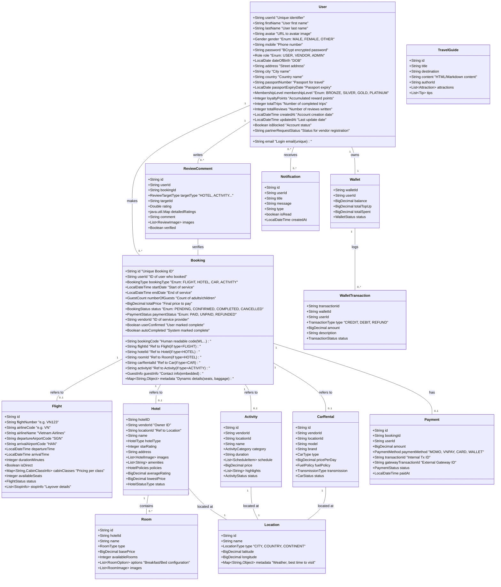
```mermaid
classDiagram
    %% --- User Entity ---
    class User {
        +String userId "Unique identifier"
        +String firstName "User first name"
        +String lastName "User last name"
        +String avatar "URL to avatar image"
        +Gender gender "Enum: MALE, FEMALE, OTHER"
        +String email "Login email (unique)"
        +String mobile "Phone number"
        +String password "BCrypt encrypted password"
        +Role role "Enum: USER, VENDOR, ADMIN"
        +LocalDate dateOfBirth "DOB"
        +String address "Street address"
        +String city "City name"
        +String country "Country name"
        +String passportNumber "Passport for travel"
        +LocalDate passportExpiryDate "Passport expiry"
        +MembershipLevel membershipLevel "Enum: BRONZE, SILVER, GOLD, PLATINUM"
        +Integer loyaltyPoints "Accumulated reward points"
        +Integer totalTrips "Number of completed trips"
        +Integer totalReviews "Number of reviews written"
        +LocalDateTime createdAt "Account creation date"
        +LocalDateTime updatedAt "Last update date"
        +Boolean isBlocked "Account status"
        +String partnerRequestStatus "Status for vendor registration"
    }

    %% --- Booking Entity ---
    class Booking {
        +String id "Unique Booking ID"
        +String bookingCode "Human readable code (WL...)"
        +String userId "ID of user who booked"
        +BookingType bookingType "Enum: FLIGHT, HOTEL, CAR, ACTIVITY"
        +String flightId "Ref to Flight (if type=FLIGHT)"
        +String hotelId "Ref to Hotel (if type=HOTEL)"
        +String roomId "Ref to Room (if type=HOTEL)"
        +String carRentalId "Ref to Car (if type=CAR)"
        +String activityId "Ref to Activity (if type=ACTIVITY)"
        +LocalDateTime startDate "Start of service"
        +LocalDateTime endDate "End of service"
        +GuestInfo guestInfo "Contact info (embedded)"
        +GuestCount numberOfGuests "Count of adults/children"
        +BigDecimal totalPrice "Final price to pay"
        +BookingStatus status "Enum: PENDING, CONFIRMED, COMPLETED, CANCELLED"
        +PaymentStatus paymentStatus "Enum: PAID, UNPAID, REFUNDED"
        +String vendorId "ID of service provider"
        +Boolean userConfirmed "User marked complete"
        +Boolean autoCompleted "System marked complete"
        +Map~String,Object~ metadata "Dynamic details (seats, baggage)"
    }

    %% --- Service Entities ---
    class Flight {
        +String id
        +String flightNumber "e.g. VN123"
        +String airlineCode "e.g. VN"
        +String airlineName "Vietnam Airlines"
        +String departureAirportCode "SGN"
        +String arrivalAirportCode "HAN"
        +LocalDateTime departureTime
        +LocalDateTime arrivalTime
        +Integer durationMinutes
        +Boolean isDirect
        +Map~String,CabinClassInfo~ cabinClasses "Pricing per class"
        +Integer availableSeats
        +FlightStatus status
        +List~StopInfo~ stopInfo "Layover details"
    }

    class Hotel {
        +String hotelID
        +String vendorId "Owner ID"
        +String locationId "Ref to Location"
        +String name
        +HotelType hotelType
        +Integer starRating
        +String address
        +List~HotelImage~ images
        +List~String~ amenities
        +HotelPolicies policies
        +BigDecimal averageRating
        +BigDecimal lowestPrice
        +HotelStatusType status
    }

    class Room {
        +String id
        +String hotelId
        +String name
        +RoomType type
        +BigDecimal basePrice
        +Integer availableRooms
        +List~RoomOption~ options "Breakfast/Bed configuration"
        +List~RoomImage~ images
    }

    class Activity {
        +String id
        +String vendorId
        +String locationId
        +String name
        +ActivityCategory category
        +String duration
        +List~ScheduleItem~ schedule
        +BigDecimal price
        +List~String~ highlights
        +ActivityStatus status
    }

    class CarRental {
        +String id
        +String vendorId
        +String locationId
        +String model
        +String brand
        +CarType type
        +BigDecimal pricePerDay
        +FuelPolicy fuelPolicy
        +TransmissionType transmission
        +CarStatus status
    }

    class Location {
        +String id
        +String name
        +LocationType type "CITY, COUNTRY, CONTINENT"
        +BigDecimal latitude
        +BigDecimal longitude
        +Map~String,Object~ metadata "Weather, best time to visit"
    }

    class TravelGuide {
        +String id
        +String title
        +String destination
        +String content "HTML/Markdown content"
        +String authorId
        +List~Attraction~ attractions
        +List~Tip~ tips
    }

    %% --- Financial Entities ---
    class Payment {
        +String id
        +String bookingId
        +String userId
        +BigDecimal amount
        +PaymentMethod paymentMethod "MOMO, VNPAY, CARD, WALLET"
        +String transactionId "Internal Tx ID"
        +String gatewayTransactionId "External Gateway ID"
        +PaymentStatus status
        +LocalDateTime paidAt
    }

    class Wallet {
        +String walletId
        +String userId
        +BigDecimal balance
        +BigDecimal totalTopUp
        +BigDecimal totalSpent
        +WalletStatus status
    }

    class WalletTransaction {
        +String transactionId
        +String walletId
        +String userId
        +TransactionType type "CREDIT, DEBIT, REFUND"
        +BigDecimal amount
        +String description
        +TransactionStatus status
    }

    class ReviewComment {
        +String id
        +String userId
        +String bookingId
        +ReviewTargetType targetType "HOTEL, ACTIVITY..."
        +String targetId
        +Double rating
        +java.util.Map detailedRatings
        +String comment
        +List~ReviewImage~ images
        +Boolean verified
    }

    class Notification {
        +String id
        +String userId
        +String title
        +String message
        +String type
        +boolean isRead
        +LocalDateTime createdAt
    }

    %% --- Relationships ---
    User "1" -- "0..*" Booking : makes
    User "1" -- "1" Wallet : owns
    User "0..*" -- "0..*" Notification : receives
    User "1" -- "0..*" ReviewComment : writes
    
    Booking "1" -- "0..1" Flight : refers to
    Booking "1" -- "0..1" Hotel : refers to
    Booking "1" -- "0..1" Activity : refers to
    Booking "1" -- "0..1" CarRental : refers to
    Booking "1" -- "0..1" Payment : has
    
    Hotel "1" -- "0..*" Room : contains
    Hotel "1" -- "1" Location : located at
    Activity "1" -- "1" Location : located at
    CarRental "1" -- "1" Location : located at
    
    Wallet "1" -- "0..*" WalletTransaction : logs
    
    ReviewComment -- Booking : verifies
```

---

## Class Diagram - User Management

Focuses on `AuthController` and `UserService` interactions.

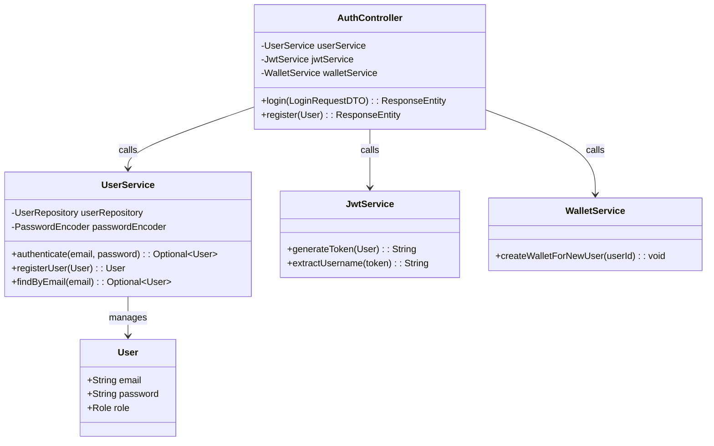
```mermaid
classDiagram
    class AuthController {
        -UserService userService
        -JwtService jwtService
        -WalletService walletService
        +login(LoginRequestDTO): ResponseEntity
        +register(User): ResponseEntity
    }

    class UserService {
        -UserRepository userRepository
        -PasswordEncoder passwordEncoder
        +authenticate(email, password): Optional~User~
        +registerUser(User): User
        +findByEmail(email): Optional~User~
    }

    class JwtService {
        +generateToken(User): String
        +extractUsername(token): String
    }

    class WalletService {
        +createWalletForNewUser(userId): void
    }

    class User {
        +String email
        +String password
        +Role role
    }

    AuthController --> UserService : calls
    AuthController --> JwtService : calls
    AuthController --> WalletService : calls
    UserService --> User : manages
```

---

## Class Diagram - Booking System

Focuses on `BookingController`, `BookingService` and resource services.

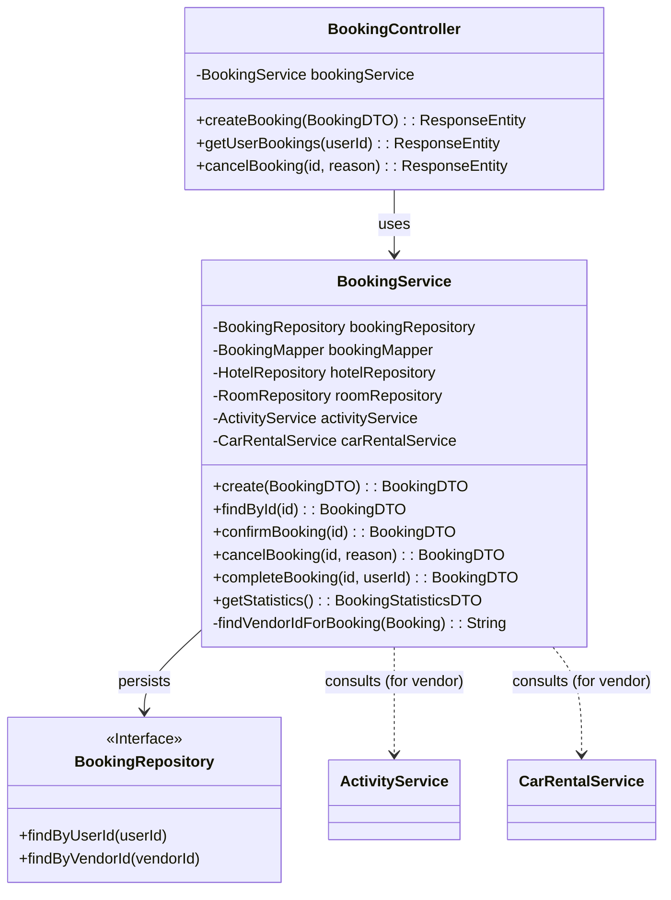
```mermaid
classDiagram
    class BookingController {
        -BookingService bookingService
        +createBooking(BookingDTO): ResponseEntity
        +getUserBookings(userId): ResponseEntity
        +cancelBooking(id, reason): ResponseEntity
    }

    class BookingService {
        -BookingRepository bookingRepository
        -BookingMapper bookingMapper
        -HotelRepository hotelRepository
        -RoomRepository roomRepository
        -ActivityService activityService
        -CarRentalService carRentalService
        +create(BookingDTO): BookingDTO
        +findById(id): BookingDTO
        +confirmBooking(id): BookingDTO
        +cancelBooking(id, reason): BookingDTO
        +completeBooking(id, userId): BookingDTO
        +getStatistics(): BookingStatisticsDTO
        -findVendorIdForBooking(Booking): String
    }

    class BookingRepository {
        <<Interface>>
        +findByUserId(userId)
        +findByVendorId(vendorId)
    }

    BookingController --> BookingService : uses
    BookingService --> BookingRepository : persists
    BookingService ..> ActivityService : consults (for vendor)
    BookingService ..> CarRentalService : consults (for vendor)
```

---

## Sequence Diagram - User Authentication

This mirrors the logic in `AuthController.java`.

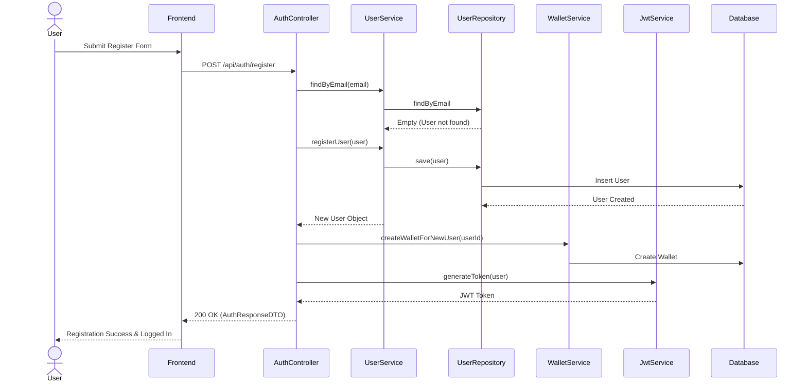
```mermaid
sequenceDiagram
    actor User
    participant Frontend
    participant AuthController
    participant UserService
    participant UserRepository
    participant WalletService
    participant JwtService
    participant Database

    User->>Frontend: Submit Register Form
    Frontend->>AuthController: POST /api/auth/register
    
    AuthController->>UserService: findByEmail(email)
    UserService->>UserRepository: findByEmail
    UserRepository-->>UserService: Empty (User not found)
    
    AuthController->>UserService: registerUser(user)
    UserService->>UserRepository: save(user)
    UserRepository->>Database: Insert User
    Database-->>UserRepository: User Created
    UserService-->>AuthController: New User Object
    
    AuthController->>WalletService: createWalletForNewUser(userId)
    WalletService->>Database: Create Wallet
    
    AuthController->>JwtService: generateToken(user)
    JwtService-->>AuthController: JWT Token
    
    AuthController-->>Frontend: 200 OK (AuthResponseDTO)
    Frontend-->>User: Registration Success & Logged In
```

---

## Sequence Diagram - Booking Flow

This mirrors the logic in `BookingService.java` where creation and confirmation are distinct steps.

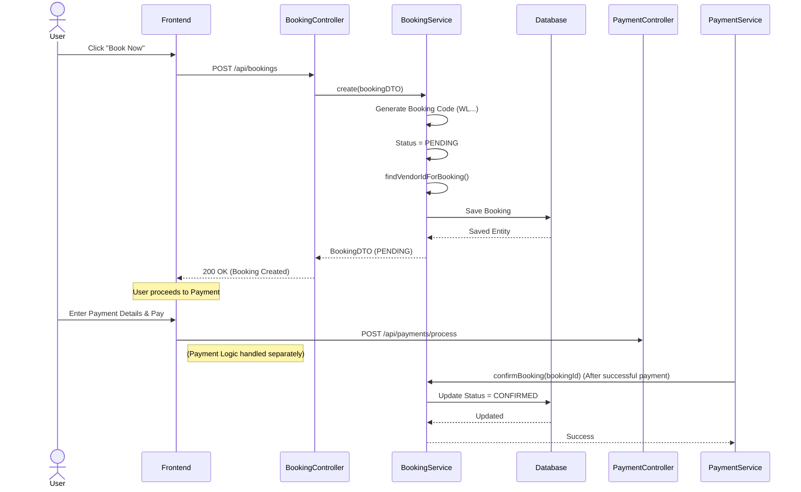
```mermaid
sequenceDiagram
    actor User
    participant Frontend
    participant BookingController
    participant BookingService
    participant Database
    
    User->>Frontend: Click "Book Now"
    Frontend->>BookingController: POST /api/bookings
    BookingController->>BookingService: create(bookingDTO)
    
    BookingService->>BookingService: Generate Booking Code (WL...)
    BookingService->>BookingService: Status = PENDING
    BookingService->>BookingService: findVendorIdForBooking()
    
    BookingService->>Database: Save Booking
    Database-->>BookingService: Saved Entity
    
    BookingService-->>BookingController: BookingDTO (PENDING)
    BookingController-->>Frontend: 200 OK (Booking Created)
    
    Note over Frontend: User proceeds to Payment
    
    User->>Frontend: Enter Payment Details & Pay
    Frontend->>PaymentController: POST /api/payments/process
    Note right of Frontend: (Payment Logic handled separately)
    
    PaymentService->>BookingService: confirmBooking(bookingId) (After successful payment)
    BookingService->>Database: Update Status = CONFIRMED
    Database-->>BookingService: Updated
    
    BookingService-->>PaymentService: Success
```

---

## Activity Diagram - Booking Process

This diagram represents the logical flow of creating a booking, as implemented in `BookingService` and `BookingController`.

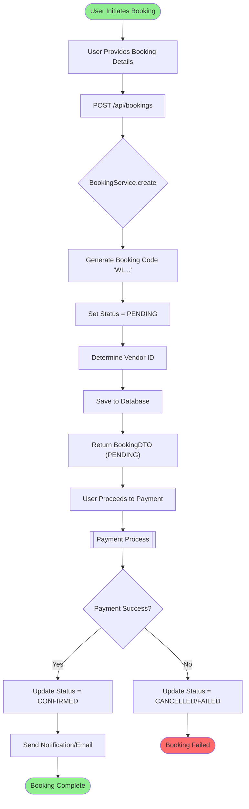
```mermaid
flowchart TD
    Start([User Initiates Booking]) --> CreateRequest[User Provides Booking Details]
    CreateRequest --> API_Call[POST /api/bookings]
    API_Call --> BookingService_Create{BookingService.create}
    
    BookingService_Create --> GenerateCode["Generate Booking Code 'WL...'"]
    GenerateCode --> SetPending[Set Status = PENDING]
    SetPending --> FindVendor[Determine Vendor ID]
    FindVendor --> SaveBooking[Save to Database]
    
    SaveBooking --> ReturnPending["Return BookingDTO (PENDING)"]
    ReturnPending --> UserPayment[User Proceeds to Payment]
    
    UserPayment --> PaymentFlow[[Payment Process]]
    
    PaymentFlow --> PaymentResult{Payment Success?}
    
    PaymentResult -->|Yes| ConfirmBooking[Update Status = CONFIRMED]
    ConfirmBooking --> NotifyUser[Send Notification/Email]
    NotifyUser --> EndSuccess([Booking Complete])
    
    PaymentResult -->|No| CancelBooking[Update Status = CANCELLED/FAILED]
    CancelBooking --> EndFail([Booking Failed])
    
    style Start fill:#90EE90
    style EndSuccess fill:#90EE90
    style EndFail fill:#FF6B6B
```

---

## Activity Diagram - Payment Process

This diagram mirrors the `PaymentService.java` logic, handling both Stripe and Wallet flows.

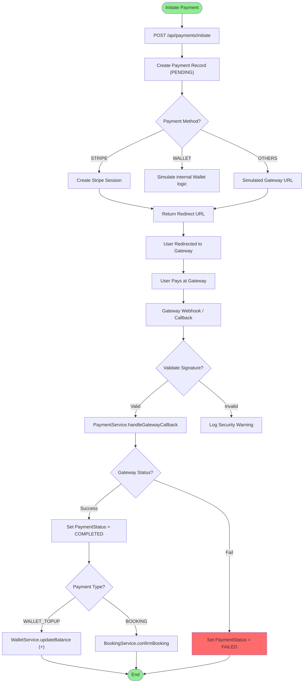
```mermaid
flowchart TD
    Start([Initiate Payment]) --> PaymentCall[POST /api/payments/initiate]
    PaymentCall --> CreatePayment["Create Payment Record (PENDING)"]
    CreatePayment --> CheckMethod{Payment Method?}
    
    CheckMethod -->|STRIPE| StripeInit[Create Stripe Session]
    CheckMethod -->|WALLET| WalletInit[Simulate internal Wallet logic]
    CheckMethod -->|OTHERS| GatewaySim[Simulated Gateway URL]
    
    StripeInit --> ReturnURL[Return Redirect URL]
    GatewaySim --> ReturnURL
    
    ReturnURL --> UserRedirect[User Redirected to Gateway]
    UserRedirect --> GatewayAction[User Pays at Gateway]
    
    GatewayAction --> Webhook[Gateway Webhook / Callback]
    Webhook --> ValidateSig{Validate Signature?}
    
    ValidateSig -->|Valid| ProcessCallback[PaymentService.handleGatewayCallback]
    ValidateSig -->|Invalid| LogError[Log Security Warning]
    
    ProcessCallback --> CheckStatus{Gateway Status?}
    
    CheckStatus -->|Success| UpdatePaid[Set PaymentStatus = COMPLETED]
    CheckStatus -->|Fail| UpdateFail[Set PaymentStatus = FAILED]
    
    UpdatePaid --> DetermineType{Payment Type?}
    
    DetermineType -->|WALLET_TOPUP| TopUpWallet["WalletService.updateBalance (+)"]
    DetermineType -->|BOOKING| ConfirmBook[BookingService.confirmBooking]
    
    TopUpWallet --> End([End])
    ConfirmBook --> End
    
    UpdateFail --> End
    
    style Start fill:#90EE90
    style End fill:#90EE90
    style UpdateFail fill:#FF6B6B
```

---

This section details the Use Cases for each major module of the Wanderlust platform.

### 8.1. Flight Booking Module

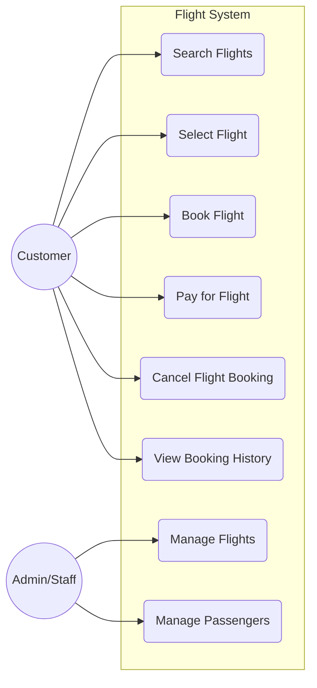
```mermaid
graph LR
    User(("Customer"))
    Admin(("Admin/Staff"))

    subgraph "Flight System"
        UC1("Search Flights")
        UC2("Select Flight")
        UC3("Book Flight")
        UC4("Pay for Flight")
        UC5("Cancel Flight Booking")
        UC6("View Booking History")
        
        UC_Admin1("Manage Flights")
        UC_Admin2("Manage Passengers")
    end

    User --> UC1
    User --> UC2
    User --> UC3
    User --> UC4
    User --> UC5
    User --> UC6

    Admin --> UC_Admin1
    Admin --> UC_Admin2
```

| Use Case Name | Select Flight |
| :--- | :--- |
| **Actor** | Customer |
| **Description** | Customer searches and selects a flight suitable for their needs. |
| **Trigger** | Customer wants to find and select a flight. |
| **Main Flow** | 1. Customer selects origin and destination. 2. System displays available flights. 3. Customer selects a flight from the list. |
| **Alternative Flow** | Customer does not find a suitable flight. |
| **Exception Flow** | System error preventing flight display. |
| **Post Condition** | Customer has selected a flight. |

| Use Case Name | Register Flight Information |
| :--- | :--- |
| **Actor** | Customer |
| **Description** | Customer enters passenger details for the selected flight. |
| **Trigger** | Customer has selected a flight and proceeds to book. |
| **Main Flow** | 1. Customer enters personal info (name, phone, email). 2. Customer selects seat and baggage info. 3. System saves info and confirms registration. |
| **Alternative Flow** | Customer enters invalid info; system requests correction. |
| **Post Condition** | Flight information is registered successfully. |

| Use Case Name | Pay for Flight |
| :--- | :--- |
| **Actor** | Customer |
| **Description** | Customer proceeds to pay for the booked flight. |
| **Main Flow** | 1. Customer selects payment method. 2. Customer enters payment details. 3. System confirms payment. |
| **Post Condition** | Payment completed; Ticket issued. |

| Use Case Name | Cancel Flight |
| :--- | :--- |
| **Actor** | Customer |
| **Description** | Customer cancels a booked flight. |
| **Main Flow** | 1. Customer requests cancellation. 2. System shows conditions and fees. 3. Customer confirms. 4. System updates status. |
| **Post Condition** | Flight cancelled; Notification sent. |

| Use Case Name | Manage Flight List |
| :--- | :--- |
| **Actor** | Manager/Admin |
| **Description** | Admin manages flight schedules and statuses. |
| **Main Flow** | 1. Admin logs in. 2. Accesses Flight Management. 3. Checks and updates flight info. |
| **Post Condition** | Flight list updated. |

### 8.2. Hotel Booking Module

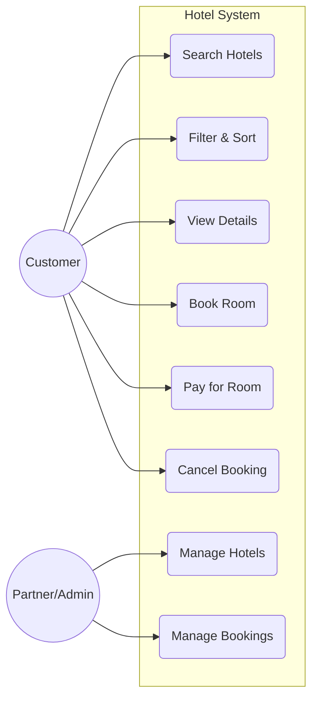
```mermaid
graph LR
    User(("Customer"))
    Vendor(("Partner/Admin"))

    subgraph "Hotel System"
        UC_H1("Search Hotels")
        UC_H2("Filter & Sort")
        UC_H3("View Details")
        UC_H4("Book Room")
        UC_H5("Pay for Room")
        UC_H6("Cancel Booking")
        
        UC_V1("Manage Hotels")
        UC_V2("Manage Bookings")
    end

    User --> UC_H1
    User --> UC_H2
    User --> UC_H3
    User --> UC_H4
    User --> UC_H5
    User --> UC_H6

    Vendor --> UC_V1
    Vendor --> UC_V2
```

| Use Case Name | Book Room |
| :--- | :--- |
| **Actor** | Customer |
| **Description** | Customer reserves a hotel room. |
| **Main Flow** | 1. Customer selects hotel and room type. 2. System shows details and price. 3. Customer confirms booking. |
| **Post Condition** | Room booked successfully. |

| Use Case Name | Cancel Room Booking |
| :--- | :--- |
| **Actor** | Customer |
| **Description** | Customer cancels a reservation. |
| **Main Flow** | 1. Customer requests cancellation. 2. System checks policy. 3. System confirms cancellation. |
| **Post Condition** | Reservation cancelled. |

| Use Case Name | Search Hotel |
| :--- | :--- |
| **Actor** | Customer |
| **Description** | Customer searches for hotels. |
| **Main Flow** | 1. Customer inputs location, dates, guests. 2. System displays matching hotels. |
| **Post Condition** | Customer finds suitable hotels. |

### 8.3. Car Rental Module

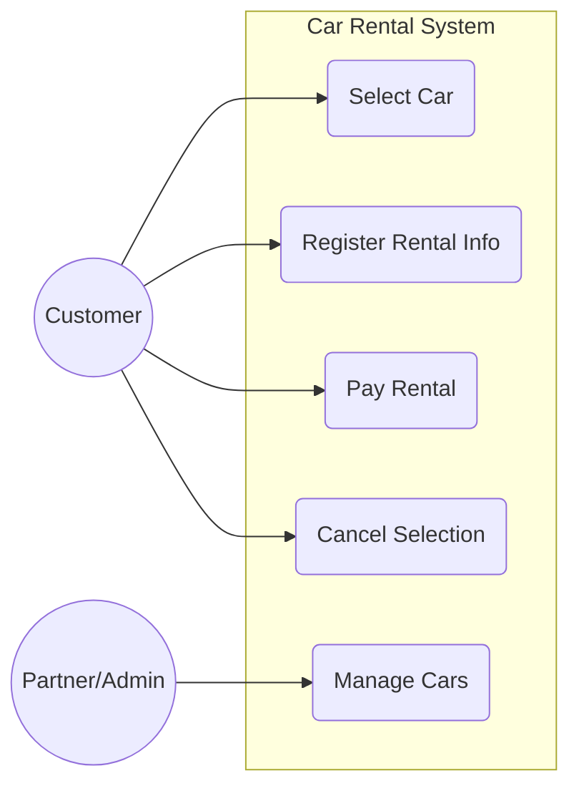
```mermaid
graph LR
    User(("Customer"))
    Vendor(("Partner/Admin"))

    subgraph "Car Rental System"
        UC_C1("Select Car")
        UC_C2("Register Rental Info")
        UC_C3("Pay Rental")
        UC_C4("Cancel Selection")
        UC_V_C1("Manage Cars")
    end

    User --> UC_C1
    User --> UC_C2
    User --> UC_C3
    User --> UC_C4

    Vendor --> UC_V_C1
```

| Use Case Name | Select Rental Car |
| :--- | :--- |
| **Actor** | Customer |
| **Description** | Customer selects a car for rent. |
| **Main Flow** | 1. Customer selects car type and dates. 2. System shows available cars. 3. Customer selects a car. 4. Registers info and pays. |
| **Post Condition** | Car selected and registered. |

### 8.4. Activity Booking Module

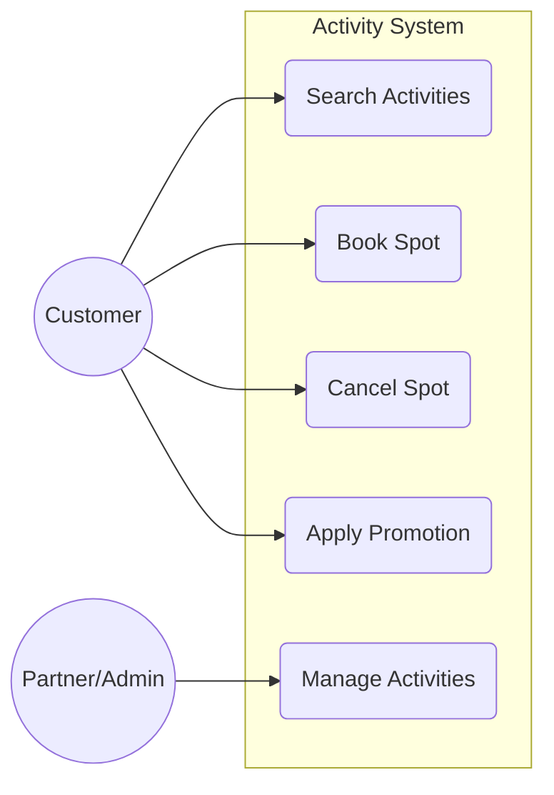
```mermaid
graph LR
    User(("Customer"))
    Vendor(("Partner/Admin"))

    subgraph "Activity System"
        UC_A1("Search Activities")
        UC_A2("Book Spot")
        UC_A3("Cancel Spot")
        UC_A4("Apply Promotion")
        
        UC_V_A1("Manage Activities")
    end

    User --> UC_A1
    User --> UC_A2
    User --> UC_A3
    User --> UC_A4
    
    Vendor --> UC_V_A1
```

| Use Case Name | Book Activity Spot |
| :--- | :--- |
| **Actor** | Customer |
| **Description** | Customer books a spot for an activity. |
| **Main Flow** | 1. Customer selects activity. 2. System shows info. 3. Customer confirms booking. |
| **Post Condition** | Spot booked successfully. |

### 8.5. Promotions & Travel Guide

#### Promotions Module

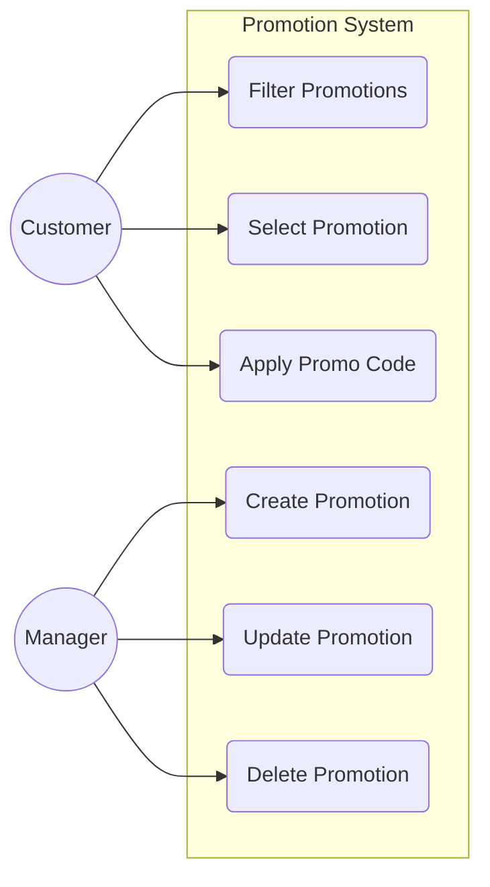
```mermaid
graph LR
    User(("Customer"))
    Vendor(("Manager"))

    subgraph "Promotion System"
        UC_P1("Filter Promotions")
        UC_P2("Select Promotion")
        UC_P3("Apply Promo Code")
        
        UC_V_P1("Create Promotion")
        UC_V_P2("Update Promotion")
        UC_V_P3("Delete Promotion")
    end

    User --> UC_P1
    User --> UC_P2
    User --> UC_P3

    Vendor --> UC_V_P1
    Vendor --> UC_V_P2
    Vendor --> UC_V_P3
```

| Use Case Name | Filter Promotions |
| :--- | :--- |
| **Actor** | Customer |
| **Main Flow** | 1. Customer selects filter criteria. 2. System displays matching promotions. |

#### Travel Guide Module

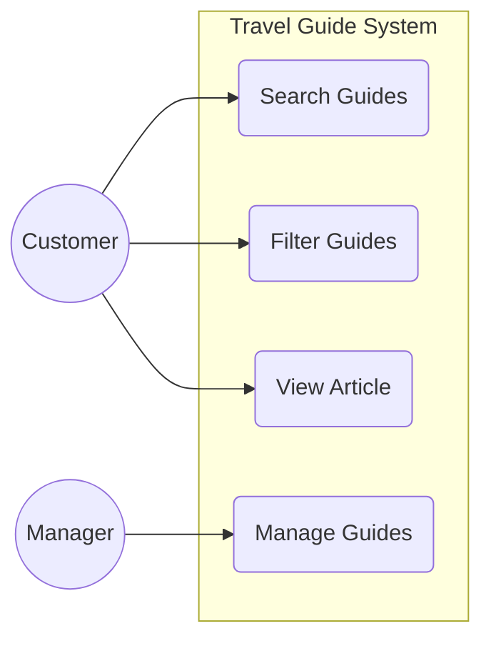
```mermaid
graph LR
    User(("Customer"))
    Vendor(("Manager"))

    subgraph "Travel Guide System"
        UC_TG1("Search Guides")
        UC_TG2("Filter Guides")
        UC_TG3("View Article")
        
        UC_V_TG1("Manage Guides")
    end

    User --> UC_TG1
    User --> UC_TG2
    User --> UC_TG3

    Vendor --> UC_V_TG1
```

| Use Case Name | Search Travel Guide |
| :--- | :--- |
| **Actor** | Customer |
| **Main Flow** | 1. Customer enters keywords. 2. System shows relevant articles. |

### 8.6. Company Info

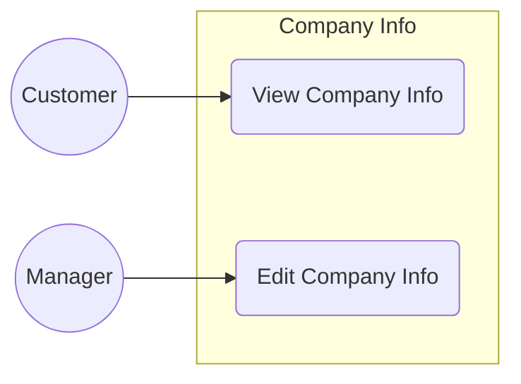
```mermaid
graph LR
    User(("Customer"))
    Admin(("Manager"))

    subgraph "Company Info"
        UC_CI1("View Company Info")
        UC_CI2("Edit Company Info")
    end

    User --> UC_CI1
    Admin --> UC_CI2
```

| Use Case Name | View Company Info |
| :--- | :--- |
| **Actor** | Customer |
| **Main Flow** | 1. Customer selects "About Us". 2. System displays company details. |

| Use Case Name | Manage Company Info |
| :--- | :--- |
| **Actor** | Admin |
| **Main Flow** | 1. Admin accesses company info settings. 2. Updates details. 3. Saves changes. |

---

## State Diagram - Booking Lifecycle

This diagram details the status transitions of a `Booking` entity, as managed by `BookingService` and `PaymentService`.

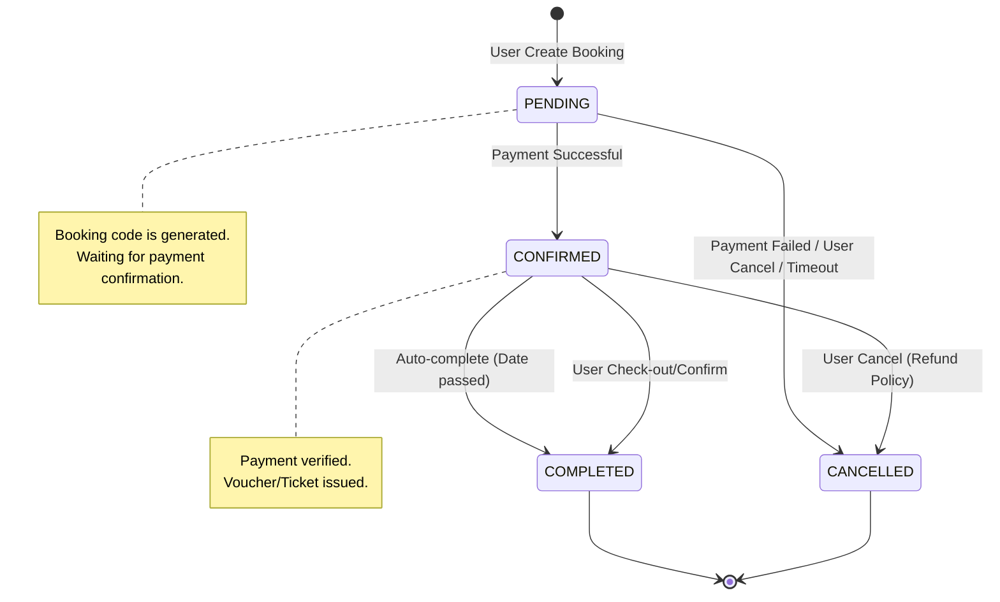
```mermaid
stateDiagram-v2
    [*] --> PENDING : User Create Booking
    
    PENDING --> CONFIRMED : Payment Successful
    PENDING --> CANCELLED : Payment Failed / User Cancel / Timeout
    
    CONFIRMED --> COMPLETED : Auto-complete (Date passed)
    CONFIRMED --> COMPLETED : User Check-out/Confirm
    
    CONFIRMED --> CANCELLED : User Cancel (Refund Policy)
    
    COMPLETED --> [*]
    CANCELLED --> [*]
    
    note right of PENDING
        Booking code is generated.
        Waiting for payment confirmation.
    end note
    
    note right of CONFIRMED
        Payment verified.
        Voucher/Ticket issued.
    end note
```

---

## Component Diagram - System Architecture

Updated to reflect the actual project structure.

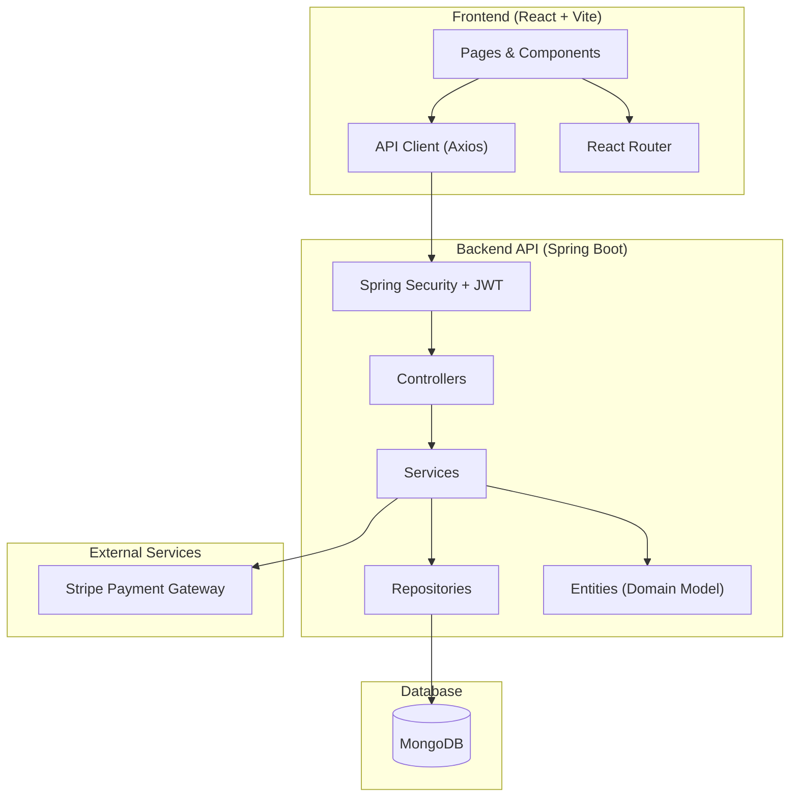
```mermaid
graph TB
    subgraph "Frontend (React + Vite)"
        UI[Pages & Components]
        API["API Client (Axios)"]
        Router[React Router]
    end

    subgraph "Backend API (Spring Boot)"
        Controller[Controllers]
        Service[Services]
        Repository[Repositories]
        Security[Spring Security + JWT]
        Entities["Entities (Domain Model)"]
    end

    subgraph "Database"
        MongoDB[(MongoDB)]
    end
    
    subgraph "External Services"
        Stripe[Stripe Payment Gateway]
    end

    UI --> Router
    UI --> API
    API --> Security
    Security --> Controller
    Controller --> Service
    Service --> Repository
    Service --> Entities
    Repository --> MongoDB
    Service --> Stripe
```

---

## Component Diagram - Frontend Architecture (Detailed)

This diagram details the component hierarchy and key interactions within the React Frontend.

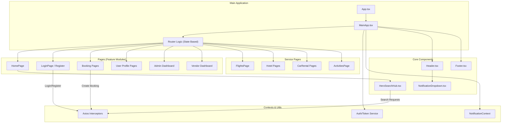
```mermaid
graph TB
    subgraph "Main Application"
        App[App.tsx]
        MainApp[MainApp.tsx]
        Router["Router Logic (State Based)"]
    end

    subgraph "Core Components"
        Header[Header.tsx]
        Footer[Footer.tsx]
        Hero[HeroSearchHub.tsx]
        Notify[NotificationDropdown.tsx]
    end

    subgraph "Pages (Feature Modules)"
        Home[HomePage]
        Auth[LoginPage / Register]
        Booking[Booking Pages]
        Profile[User Profile Pages]
        Admin[Admin Dashboard]
        Vendor[Vendor Dashboard]
    end

    subgraph "Service Pages"
        Flights[FlightsPage]
        Hotels[Hotel Pages]
        Car[CarRental Pages]
        Activity[ActivitiesPage]
    end
    
    subgraph "Contexts & Utils"
        AuthContext[Auth/Token Service]
        NotifyCtx[NotificationContext]
        API[Axios Interceptors]
    end

    App --> MainApp
    MainApp --> Router
    MainApp --> AuthContext
    MainApp --> NotifyCtx

    Router --> Home
    Router --> Auth
    Router --> Booking
    Router --> Profile
    Router --> Admin
    Router --> Vendor
    Router --> Flights
    Router --> Hotels
    Router --> Car
    Router --> Activity

    MainApp --> Header
    MainApp --> Footer

    Header --> Notify
    Home --> Hero
    
    Hero -->|"Search Requests"| API
    Booking -->|"Create Booking"| API
    Auth -->|"Login/Register"| API
```

### Detailed Component Information

#### 1. **MainApp.tsx**
   - **Purpose**: The root component managing the global state of the application, including the current page route and user session. It acts as a custom router.
   - **Key Variables/State**:
     - `currentPage` (State): Stores the current active page identifier (e.g., `'home'`, `'flights'`).
     - `pageData` (State): Holds data passed between pages (e.g., search results, booking details).
     - `userRole` (State): The role of the currently logged-in user (`USER`, `ADMIN`, `VENDOR`).
   - **Key Methods**:
     - `handleNavigate(page, data)`: Transitions the application to a new page and passes necessary data.
     - `handleLogin(role)`: Updates the state upon successful user login.

#### 2. **Header.tsx**
   - **Purpose**: The top navigation bar, responsive to user state (logged in/out) and scrolling.
   - **Key Variables/Props**:
     - `currentPage` (Prop): Used to highlight the active navigation item.
     - `userRole` (Prop): Determines which menu items (Profile, Admin Panel) are visible.
     - `walletBalance` (State): Displays the user's current wallet balance, fetched via API.
     - `notifications` (Context): List of user notifications displayed in the dropdown.
   - **Key Interactions**:
     - **NotificationDropdown**: Toggles the visibility of user notifications.
     - **ProfileDropdown**: Provides access to generic user settings and role-specific dashboards.

#### 3. **HeroSearchHub.tsx**
   - **Purpose**: The central search interface on the Home page, supporting multiple service types (Flights, Hotels, Cars, Activities).
   - **Key Variables/State**:
     - `activeService` (State): Toggles between tabs (`flights`, `hotels`, `car-rental`, `activities`).
     - `flightDepartDate/returnDate` (State): Stores selected dates for flight queries.
     - `fromAirport/toAirport` (State): Objects containing code and city for selected routes.
     - `passengers` (State): Object tracking `adults`, `children`, `infants`.
   - **Key Interactions**:
     - Calls `flightApi.searchFlights()` to execute queries.
     - Triggers `onNavigate('search', data)` to redirect to the results page with query parameters.

#### 4. **BookingDetailsPage.tsx** (in Pages/Booking)
   - **Purpose**: Allows users to review their selection and enter guest details before payment.
   - **Key Variables/State**:
     - `bookingData` (Prop/State): Received from the previous search/selection page.Contains item ID, price, and dates.
     - `guestInfo` (State): Form data for the primary contact and guests.

---

## Proposed/Future Modules

The following modules specifically related to **AI Chatbot** and **Smart Itinerary Planning** are defined in the requirements and design phase but are **not yet implemented** in the current code.

### 1. Class Diagram - AI Chatbot & Itinerary Module (Planned)

This module will handle user travel queries and generate itineraries based on preferences.

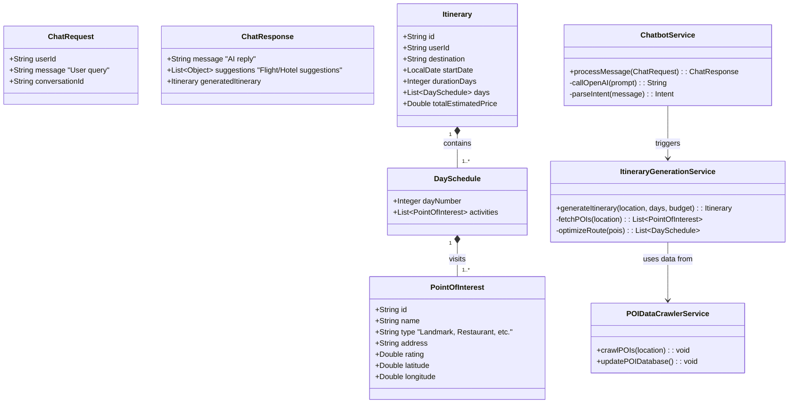
```mermaid
classDiagram
    %% --- AI/Chatbot Entities ---
    class ChatRequest {
        +String userId
        +String message "User query"
        +String conversationId
    }

    class ChatResponse {
        +String message "AI reply"
        +List~Object~ suggestions "Flight/Hotel suggestions"
        +Itinerary generatedItinerary
    }

    class Itinerary {
        +String id
        +String userId
        +String destination
        +LocalDate startDate
        +Integer durationDays
        +List~DaySchedule~ days
        +Double totalEstimatedPrice
    }

    class DaySchedule {
        +Integer dayNumber
        +List~PointOfInterest~ activities
    }

    class PointOfInterest {
        +String id
        +String name
        +String type "Landmark, Restaurant, etc."
        +String address
        +Double rating
        +Double latitude
        +Double longitude
    }

    %% --- Services ---
    class ChatbotService {
        +processMessage(ChatRequest): ChatResponse
        -callOpenAI(prompt): String
        -parseIntent(message): Intent
    }

    class ItineraryGenerationService {
        +generateItinerary(location, days, budget): Itinerary
        -fetchPOIs(location): List~PointOfInterest~
        -optimizeRoute(pois): List~DaySchedule~
    }

    class POIDataCrawlerService {
        +crawlPOIs(location): void
        +updatePOIDatabase(): void
    }

    ChatbotService --> ItineraryGenerationService : triggers
    ItineraryGenerationService --> POIDataCrawlerService : uses data from
    Itinerary "1" *-- "1..*" DaySchedule : contains
    DaySchedule "1" *-- "1..*" PointOfInterest : visits
```

### 2. Sequence Diagram - AI Itinerary Generation (Planned)

Proposed flow for how the chatbot will interact with the system to create an itinerary.

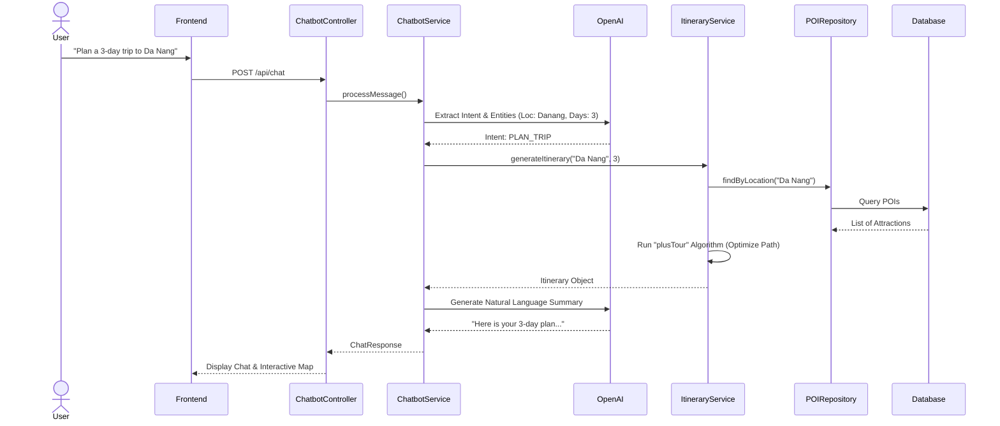
```mermaid
sequenceDiagram
    actor User
    participant Frontend
    participant ChatbotController
    participant ChatbotService
    participant OpenAI
    participant ItineraryService
    participant POIRepository
    participant Database

    User->>Frontend: "Plan a 3-day trip to Da Nang"
    Frontend->>ChatbotController: POST /api/chat
    ChatbotController->>ChatbotService: processMessage()
    
    ChatbotService->>OpenAI: Extract Intent & Entities (Loc: Danang, Days: 3)
    OpenAI-->>ChatbotService: Intent: PLAN_TRIP
    
    ChatbotService->>ItineraryService: generateItinerary("Da Nang", 3)
    
    ItineraryService->>POIRepository: findByLocation("Da Nang")
    POIRepository->>Database: Query POIs
    Database-->>POIRepository: List of Attractions
    
    ItineraryService->>ItineraryService: Run "plusTour" Algorithm (Optimize Path)
    ItineraryService-->>ChatbotService: Itinerary Object
    
    ChatbotService->>OpenAI: Generate Natural Language Summary
    OpenAI-->>ChatbotService: "Here is your 3-day plan..."
    
    ChatbotService-->>ChatbotController: ChatResponse
    ChatbotController-->>Frontend: Display Chat & Interactive Map
```

---

## Support & Feedback Modules (New)

These diagrams illustrate the workflows for **Refund Requests** and **Review Moderation**, based on `RefundService.java` and `ReviewCommentService.java`.

### 1. Activity Diagram - Refund Process

Illustrates the flow of a user requesting a refund and the administrative approval steps.

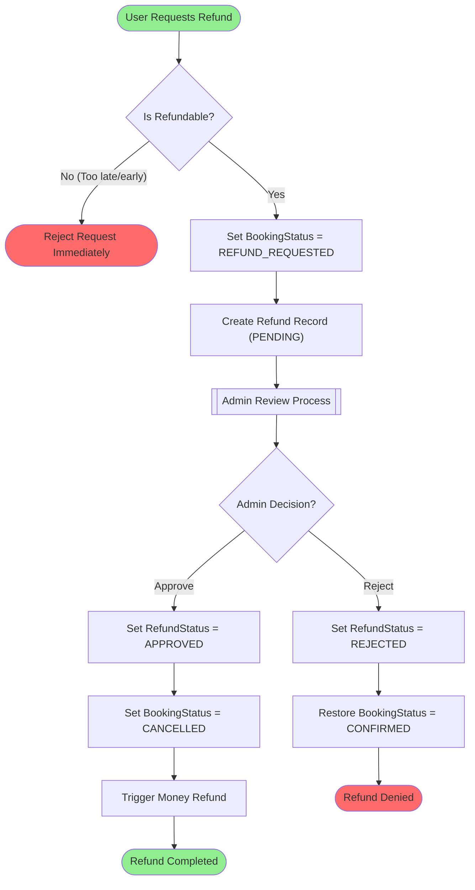
```mermaid
flowchart TD
    Start([User Requests Refund]) --> CheckWindow{Is Refundable?}
    
    CheckWindow -->|"No (Too late/early)"| Deny([Reject Request Immediately])
    
    CheckWindow -->|Yes| SetRequested[Set BookingStatus = REFUND_REQUESTED]
    SetRequested --> CreateRefund["Create Refund Record (PENDING)"]
    
    CreateRefund --> AdminReview[[Admin Review Process]]
    
    AdminReview --> AdminDecision{Admin Decision?}
    
    AdminDecision -->|Approve| ApproveRefund[Set RefundStatus = APPROVED]
    ApproveRefund --> CancelBooking[Set BookingStatus = CANCELLED]
    CancelBooking --> RefundMoney[Trigger Money Refund]
    RefundMoney --> EndRefund([Refund Completed])
    
    AdminDecision -->|Reject| RejectRefund[Set RefundStatus = REJECTED]
    RejectRefund --> RestoreBooking[Restore BookingStatus = CONFIRMED]
    RestoreBooking --> EndReject([Refund Denied])
    
    style Start fill:#90EE90
    style EndRefund fill:#90EE90
    style EndReject fill:#FF6B6B
    style Deny fill:#FF6B6B
```

### 2. Sequence Diagram - Review & Moderation

Shows how a review is posted, moderated by an Admin, and responded to by a Vendor.

```mermaid
sequenceDiagram
    actor User
    actor Admin
    actor Vendor
    participant Frontend
    participant ReviewService
    participant Database

    User->>Frontend: Submit Review (Rating + Comment)
    Frontend->>ReviewService: create(ReviewDTO)
    
    ReviewService->>ReviewService: Validate Booking (Must be COMPLETED)
    ReviewService->>Database: Save Review (Status = PENDING)
    ReviewService-->>Frontend: Review Submitted (Pending Approval)
    
    Note right of Admin: Moderation Queue
    
    Admin->>ReviewService: findAllPending()
    ReviewService-->>Admin: List of Pending Reviews
    
    Admin->>ReviewService: moderateReview(id, APPROVED)
    ReviewService->>Database: Update Status = APPROVED
    
    Note right of Vendor: Notification of new review
    
    Vendor->>Frontend: View My Service Reviews
    Frontend->>ReviewService: getReviewsByVendor()
    ReviewService-->>Frontend: List of Approved Reviews
    
    Vendor->>Frontend: Reply to Review
    Frontend->>ReviewService: respondToReview(id, replyText)
    ReviewService->>Database: Save Vendor Response
    
    ReviewService-->>Frontend: Response Saved
```

---

## Security Architecture (New)

This diagram visualizes the Security Filter Chain configuration in `SecurityConfig.java`.

### 1. Security Filter Chain Diagram

Visualizes how a request flows through the Spring Security filters.

```mermaid
flowchart TD
    Req([Incoming Request]) --> Cors[CORS Filter]
    Cors --> Csrf["CSRF Filter (Disabled)"]
    Csrf --> JwtFilter[JwtAuthenticationFilter]
    
    JwtFilter --> CheckJWT{Has Valid JWT?}
    CheckJWT -->|Yes| SetCtx[Set SecurityContext]
    CheckJWT -->|No| NextFilter[Next Filter]
    
    SetCtx --> NextFilter
    
    NextFilter --> AuthMgr[Authorization Manager]
    
    AuthMgr --> MatchPath{Match Path Pattern}
    
    MatchPath -->|/api/auth/**| PermitAll([Permit All])
    MatchPath -->|Public GET API| PermitAll
    MatchPath -->|Webhooks| PermitAll
    
    MatchPath -->|/api/admin/**| CheckRole{Role = ADMIN?}
    MatchPath -->|Other Secured API| CheckAuth{Is Authenticated?}
    
    CheckRole -->|Yes| Dispatch[DispatcherServlet]
    CheckRole -->|No| AccessDenied([403 Access Denied])
    
    CheckAuth -->|Yes| Dispatch
    CheckAuth -->|No| EntryPoint([401 Unauthorized])
    
    Dispatch --> Controller[[Controller Logic]]
    
    style PermitAll fill:#90EE90
    style AccessDenied fill:#FF6B6B
    style EntryPoint fill:#FF6B6B
    style Controller fill:#ADD8E6
```

---

## Status
**User Request Completed**
